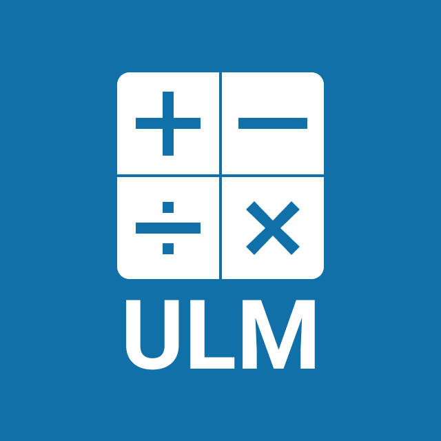

<div align="center">
  <h1>
    
  </h1>
  <p>A language for describing mathematical expressions.</p>
  <a href="https://ulm-spec.haydn.now.sh/">Spec</a> | <a href="https://ulm-playground.haydn.now.sh">Playground</a>
</div>

## Overview

Universal Language for Mathematics (ULM) is a language for describing both the semantics and presentation of mathematical expressions.

⚠️ WIP ⚠️

A ULM [AST](https://en.wikipedia.org/wiki/Abstract_syntax_tree) might look something like this:

```yaml
type: root
value:
  type: multiply
  left:
    type: int
    value: 4
  right:
    type: int
    value: 7
```

Which might be presented like this:

```
4 × 7
```

We could also layer on some information to explicitly define how it should be presented:

```yaml
type: root
value:
  type: multiply
  style: dot
  left:
    type: int
    value: 4
  right:
    type: int
    value: 7
```

Which might be presented like this:

```
4 • 7
```

Alternatively, it could be presented in words:

```
four multiplied by seven
```

It could even present in another language:

```
cuatro multiplicados por siete
```

It might even be presented graphically:

```
🦄🦄🦄🦄
🦄🦄🦄🦄
🦄🦄🦄🦄
🦄🦄🦄🦄
🦄🦄🦄🦄
🦄🦄🦄🦄
🦄🦄🦄🦄
```
