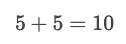
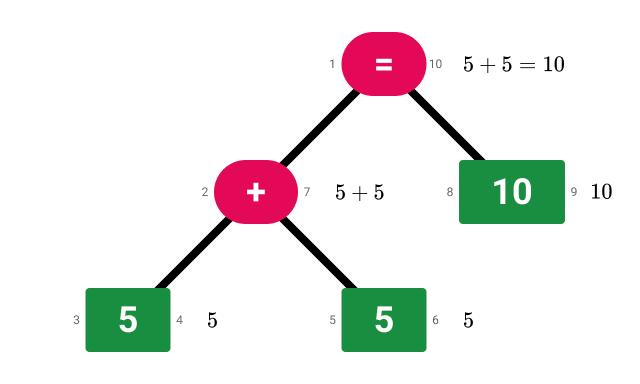
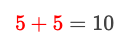
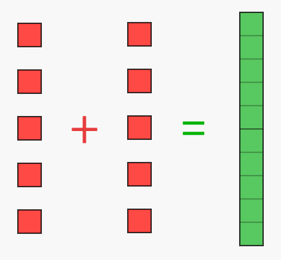
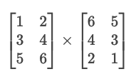
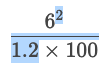
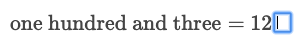
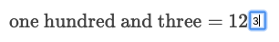

<div align="center">
  <h1>
    
  </h1>
  <p>A language for describing mathematical expressions.</p>
  <a href="https://ulm-spec.haydn.now.sh/">Specification</a> | <a href="https://ulm-playground.haydn.now.sh">Playground</a>
</div>

## Introduction

ULM (Universal Language for Mathematics) is a language for describing mathematical expressions. It is designed for use in digital education contexts where it is important to encode both the semantics and presentation of an expression.

In it's most basic usage, ULM can encode an expression such as `5 + 5 = 10` like this:

```ulm
=(+(5, 5), 10)
```

However, a ULM can also describe other important information about an expression such as how it should be presented and selection information:

```ulm
=(+(5, 5, { color: "red" }), 10)
2:7
```

## Goals

### Separation of semantics and presentation

instead of "sigma" — we encode it as a "summation operator". Use of an upperase sigma symbol to represent this is a presentation concern and should be handled separately.

Presentation alongside semantics:

How an expression is presented is often just as important as the meaning of the expression.

Being able to easily switch between multiple representations of the same concept is powerful for educational applications.

The fundamental concepts expressed are unlikely to change rapidly in the coming decades, but the way they're presented and how we interact with them is probably going to change dramatically.

Transformable without loss of presentation:

Precise and well documented data structure to allow transformations to be done. There should be a ecosystem.

Ensure information about how an expression has been presented can be retained and reconstructed. This includes the ability for presentational information to be retained through a transformation (such as simplifying an expression of evaluating it).

Retaining as much of the original presentation to retain coninuity a reduce cognitive load.

Tell a student something they've done it wrong simply because they've presented it a way that doesn't exactly match what the computer was expecting is an awful experience. Instead, we should be able to detect if they're semantically correct and provide guidance towards to correct way of presenting their work.

Example:

Maybe a student entered `(2 + 2) + 4 = 8`, but  `2 + 2 + 4 = 8` is what we're really after. The student is semantically correct, but we might want to help them understand that the brackets are unneccesary.

```ulm
=(+(+(2, 2), 4), 8)
```

```ulm
=(+(+(2, 2, { brackets: TRUE }), 4), 8)
```

### Optional ambiguity, completeness and correctness

unless explicitly defined, no expression is ambiguous

In ULM **an expression's meaning can always be precisely encoded**, but can also be explicitly left up to the interpreter for disambiguating using context or convention when desired.

Here's a long list of unnecessary hurdles a students of mathematics currently have to overcome:

https://math.stackexchange.com/questions/1024280/most-ambiguous-and-inconsistent-phrases-and-notations-in-maths

With ULM we should be able to completely eliminate the unambiguous nature of the glyphs we currently use to represent mathematical concepts.

Abstract away the meaning of an expression to make it agnostic to it's repesentation. `2 ✕ 2 = 4` is the same as `(2 ✕ 2) = 4`, but it's non-trival with current methods of encoding a mathematical expression to determine that.

- retains semantical information for processing (can be evaluated and manipulated/transformed)

- localisation (within a region, a curriculum or a field of study)
- accessibility

Optional completeness and correctness:

Unlike programming languages, ULM is expected to sometimes represent expressions that are impossible to evaluate. The typical use cases for this are when teaching and the use of incomplete or incorrect expressions is desirable for building up a concept, demonstrating a counter example, letting a student identify mistakes or to provide a scaffolding for a student to complete themselves.

### Designed for an interactive internet

ULM isn't just for typesetting — it's for building immersive experiences that give users tools for exploring concepts in

- interactive (can handle cursors, selections and identified interactive/placeholder content)
- Internet friendly: minimal data over-the-wire
- technology agnostic spec for implementation in multiple programming languages to support diverse client-side and server-side environments

### Early education first

The level of mathematics you learn at school is where ULM will have the most impact. When making a tradeoff in the design of the language the most simple case should be favoured.

Advanced use cases are a nice to have, but shouldn't be supported at the cost of basic use cases.

## Examples

### Simple equation



ULM:

```ulm
=(+(5, 5), 10)
```

AST:



### Highlighting



```ulm
=(+(5, 5, { color: "red" }), 10)
```

### Base ten blocks



```ulm
=(
  +(5, 5, { color: "red" }),
  10,
  {
    display: "base-ten-blocks",
    color: "green"
  }
)
```

### Matrices



```ulm
*(
  Matrix(1, 2, 3, 4, 5, 6, w: 2n, h: 3n),
  Matrix(6, 5, 4, 3, 2, 1, w: 2n, h: 3n)
)
```

### Selections



```ulm
/(
  ^(6, 2),
  *(1.2, 100)
)
6:11
```

Note: `6` and `11` are the left and right values in a [Nested set model](https://en.wikipedia.org/wiki/Nested_set_model) of the expression.

### Placeholder



```ulm
=(
  (103, { display: "text" }),
  ExpandedNumber(
    1n,
    0n,
    ?
  )
)
10:11
```



```ulm
=(
  (103, { display: "text" }),
  ExpandedNumber(
    1n,
    0n,
    ?(3)
  )
)
12
```

## Related projects

- [LaTeX](https://www.latex-project.org/)
- [MathML](https://www.w3.org/Math/)
- [AsciiMath](http://asciimath.org/)
- [OpenMath](https://www.openmath.org/)
