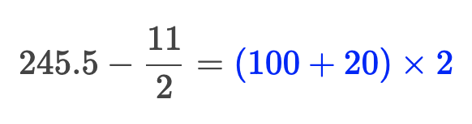

Universal Language for Mathematics (ULM)
----------------------------------------

⚠️ DRAFT

# Overview

ULM is a language for describing both the semantics and presentation of
mathematical expressions.

Here is a simple expression written in ULMScript:

```ulm example
+(2, 2)
```

That's just `2 + 2`.

Here is a more complicated expression:

```ulm example
=(
  -(
    245.5,
    ÷(11, 2, { division-style: "fraction" })
  ),
  *(
    +(100, 20),
    2,
    { color: "blue" }
  )
)
```

Which could be displayed like this:



# [Source](./SOURCE.md)

# [Tokens](./TOKENS.md)

# [Syntax](./SYNTAX.md)

# [Expressions](./EXPRESSIONS.md)

# [Presentation](./PRESENTATION.md)
